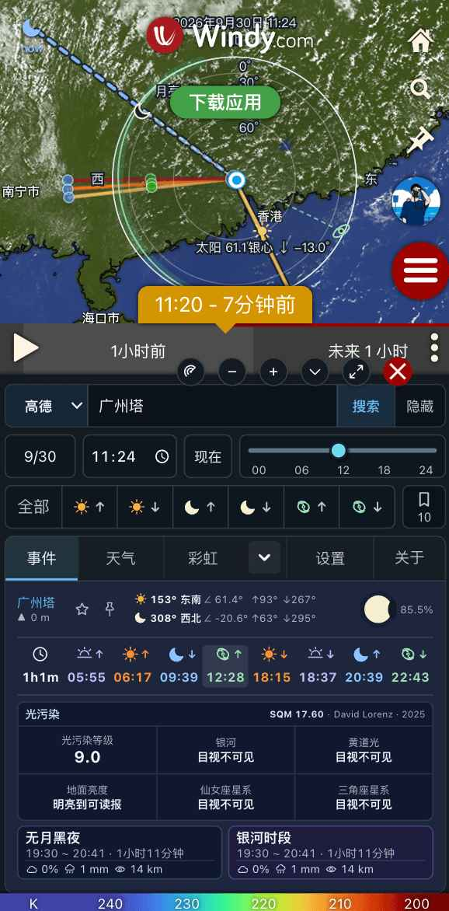

# Sun & Moon Path for Windy

**中文** · [English](README_EN.md)

在 Windy 地图上规划日出、日落、月亮和银河拍摄：查看天体方向、云层距离参考、天气和收藏机位的观测条件。支持中英文、桌面端与移动端。



## 安装与使用

当前版本：**0.10.4** · [更新记录](https://github.com/bytepoem/windy-plugin-sun-moon-path/releases/tag/0.10.4)

将以下地址填入 Windy 的外部插件加载入口，加载后打开 **Sun & Moon Path**：

```text
https://windy-plugins.com/17629746/windy-plugin-sun-moon-path/0.10.4/plugin.min.js
```

1. 单击地图选点，或输入 WGS84 / GCJ-02 坐标。中文地点搜索需在设置中填写高德、百度或腾讯地图 API Key。不使用搜索时，点击搜索框右侧“隐藏”；在设置中关闭“隐藏地点搜索框”即可恢复。
2. 选择日期，在「事件」查看日月升落、实时方位、月相、无月和银河观测时段。首次使用且未保存语言时显示双语选择弹窗，默认选中中文，确认后保存；之后可在「设置」顶部右侧切换。顶部收藏按钮显示图标和收藏数量。
3. 在「云层遮挡」选择目标与云高，通过升落快捷按钮、当地时间或分钟滑条规划拍摄时刻。云图、模型和云层模式位于同一行，高度来源及对应子设置位于下一行。
   顶部银心升落按钮保持当前 Tab，在事件页显示升落时刻及前后 30 分钟的三条绿色方位线；地平线以下的线仅供方向参考，不代表可见，当天无对应事件时不可用。在云层规划中，使用顶部日月与银心事件按钮切换升落时刻，云图选择与当地时间滑条集中在同一行；事件页时间栏使用图标展示日月和银心升落时刻；手动调整时间后取消升落高亮。“全部”仅用于日月事件总览。移动端收起窗口保留云层参考线和规划时间，进入设置、关于或天气保留云层参考线和规划时间，切换地图规划功能或关闭插件后清除云层参考线。
4. 查看下方天气，或选择 2–5 个收藏地点比较同一天的观测条件。移动端支持收起、小窗口与全屏。
5. 在「云层遮挡」旁的下拉菜单切换到「彩虹」，选择日虹／月虹并调整当地时间，也可用顶部日月升落按钮跳转。支持双彩虹与完整圆圈；切换 Tab 保留本次规划选项，移动端收起保留图层，进入设置、关于或天气保留此前图层与规划时间；切换地图规划功能或关闭插件清除图层。

## 主要功能

| 功能 | 用途 |
| --- | --- |
| 日月方向 | 显示升落前后 30 分钟的方向线、实时日月方向，以及 200 / 400 km 参考点；可启用 600 km 标记 |
| 共用时间条 | 日期旁统一输入或拖动当地时间，下方显示升落按钮；事件、云层遮挡、彩虹共用，收起仍保留，点击升落按钮或事件时刻可跳转 |
| 事件天空盘 | 保留长线，同时显示日月图标、银河投影带和银心，跟随共用时间条 |
| 即将事件 | 今日事件栏以柔和背景色突出下一个事件，倒计时对应同一事件；跟随真实当前时刻，其他日期不显示实时标记 |
| 云层规划 | 通过六个升落按钮选择太阳、月亮或银心；单层／分层均支持 Windy 预报云底、云量剖面、温湿剖面及手动海拔，地图展示视线交点和云距包络，配有中英文图解 |
| 彩虹规划 | 日虹／月虹的顶部高度、左右地平线交点与中心方位，支持双虹、完整圆圈和地图天空角度投影 |
| 天气与观测 | Windy / Open-Meteo 数据源和 EC / GFS / ICON 模型，覆盖可用的过去 6 小时至未来 5 天，结合天气、月光与目标可见性展示观测时段 |
| 收藏对比 | 复用 Windy 收藏，可搜索、排序，比较天气、天文事件、海拔与 David Lorenz 2025 光污染数据 |
| 雷达叠加 | RainViewer 无需 Key，可叠加到 Windy 图层并跟随宿主时间条，显示实际雷达时次 |
| 单位与说明 | 跟随 Windy 温度、风速、降水、距离及海拔单位；「设置 → 使用说明」提供图例与使用边界，「关于」显示版本、更新日志、[小红书关注](https://xhslink.cn/o/rXpBcBK0Qy)及[爱发电自愿打赏入口](https://afdian.com/a/bytepoem) |

## 数据边界

拖动 Windy 自带时间轴会同步规划日期、当地时间及事件天空盘／彩虹／云层视线；跨天重新计算事件。标有 `now` 的实时日月长线保持真实当前时刻，不随规划时间变化。

事件天空盘在盘顶标注时刻，原有实时日月长线仍表示现在。天空盘北上东右，圆周为地平线、圆心为天顶；虚线和向下箭头表示地平线下。银河带为几何走向示意，带宽不代表实际角宽，也不保证可见。切换云距／彩虹或关闭插件会移除天空盘。

实时太阳长线为金色实线、月亮长线为浅蓝虚线，带深色描边；末端仅显示日月图标和小号 `now`，无背景框。每 5 秒按当前时刻刷新，不跟随规划时间条或观测日期。长线末端仅为方位参考，不代表天体的地理位置；云层视线仍跟随规划时间。

「云层遮挡／彩虹」下拉菜单会记住上次选择，刷新后恢复对应 Tab 名称和功能。点击箭头只展开菜单，选择功能后才切换 Tab。

刷新或重新打开插件时，共用时间条回到当前日期和时间，按所选地点的时区显示；点击时间旁的「现在」也可一步返回。打开或点击时只取一次当前时刻，不持续走时。手动选择后，切换 Tab、收起面板或调整参数不会重置时间；规划时间不跨次保存，彩虹的日虹／月虹、双彩虹、完整圆圈选项仍保存在当前浏览器。切换日期／地点时，手动时间按新日期和当地时区解释，事件时间重新计算；“全部”使用所选日期的当前当地钟点。拖动时只做本地预览，结束后按云层设置同步 Windy。

彩虹地图的彩色同心圆标记反太阳点／反月亮点：方位与所选光源相差 180°、高度相反，可能位于地平线下；光源在地平线下时隐藏此标记。七彩弧线宽度与同心圆大小仅用于清晰显示，不代表实际角宽，也不预测佛光是否出现。

- **彩虹弧线是几何构图参考。** 主虹约 42°、副虹约 51°；地图采用天空俯视正投影，0° 圈为水平地平线，高度刻度并非等距，不表示真实距离。完整圆圈的上下半球方向可能重叠，实线表示地平线上、虚线表示地平线下。所选光源低于水平地平线时隐藏虹弧，虹弧数据显示 —，双虹和完整圆圈也遵循此条件。地图的方位线、图标和名称跟随所选日虹／月虹光源，光源在地平线下时用虚线与向下标记区分。虹弧加粗仅为显示样式，不改变角度计算。完整圆圈实际可见还需下方有受光水滴和无遮挡视线。
- **主虹条件评估**：点击「评估当前时刻」，按主虹左、中、右方位各取三个距离，读取 Open-Meteo 所选 ECMWF／GFS／ICON 模型的小时液态降水与直射法向辐射，独立于天气表的数据源设置。距离为模型近似网格间距（9／22／13 km）的 1、2、3 倍，不代表雨滴距离或独立观测。完整数据中，同一点小时雨量 ≥0.1 mm 且平均直射法向辐射 ≥120 W/m² 时显示「条件较有利」，仅有降雨信号显示「条件一般」，无降雨信号显示「条件不利」；字段缺失或超出范围显示「数据不足」。这些是未校准的经验筛选，可信度固定为低，不是百分比概率，也不能排除未采样区域的彩虹。界面显示对应的小时区间与逐点依据；小时雨光不证明同一瞬间雨滴受光，未检查三维云层。不评估月虹或地平线下弧段；切换规划上下文清除旧评估，关闭面板取消请求。
- **虹弧地形参考**：同一次评估使用 Open-Meteo / Copernicus DEM GLO-90（90 m 数据），沿可见主虹取 7 个方向，每方向取 0.1、0.25、0.5、0.75、1、1.5、2、3、4、5、7、10、15、20、25、30 km 共 16 个距离。机位高程使用同一 DEM，视点离地高度默认 2 m，可修改为 0–1000 m；计入地球曲率，不校正折射。展示虹弧高度、采样山体最大仰角与距离，山体高于虹弧时提示潜在遮挡。雨滴可能在山前，不能据此断言彩虹被挡；也不检查太阳到雨滴的山影。稀疏采样可能漏掉山脊，不能精确刻画建筑或树木，“未发现”不等于无遮挡。
- **沿途低能见度参考**：采样机位以及各候选雨区方向的中点和终点，并复用同方向更近的采样点，展示每条路径最低近地面能见度；低于 5 km 为经验风险阈值，不与候选雨区距离直接比较。使用同一模型、雨量区间末端的能见度时次并明确显示，不代表整小时或高空视线。地形和能见度独立展示，不折算概率或改写雨光等级；一项失败不抹除其他已成功的数据，缺测保留未知。改变离地高度也会取消并清空旧评估；新增高度和结果仅保留在当前面板会话。
- **云层距离是几何参考。** 当前点云高不代表远方云区；不沿光路采样天气、地形、云厚或消光，不保证目标可见或出现朝晚霞。调整时间时保持所选天体。卫星云图为独立实况对照，不与未来预报时刻同步。云底离地高度与计算海拔分别标注。详见[云层计算说明](docs/cloud-obstruction.md)。
- **云高来源可切换。** 单层默认预报云底，分层默认云量剖面；温湿剖面是候选云层估算，不等同实测。缺测不自动换方法，手动高度与阈值独立保存。具体阈值、分层和高度基准见云层计算说明。
- **天气来源有区别。** 天气表格、观测时段和收藏对比共用所选来源；云底、分层云高及地图云图始终使用 Windy。不同来源的云层划分可能不同，缺测保留空值，请求失败不自动换源。
- **AOD 与能见度。** AOD 始终来自 Open-Meteo 提供的 CAMS 数据；Windy 的能见度由独立 Open-Meteo 数据补充，Open-Meteo 模式则使用所选模型的能见度。
- **时间与降水。** Windy 使用原始时间步长；Open-Meteo 逐小时序列可能含服务端插值，降水为标签前一小时累计量。观测时段显示匹配时次的降水范围，不是窗口累计量；过去时段是模式结果，不是实况。

## 使用统计

仅当 Windy 的 `consent.analytics` 为 `true` 时采集：百度统计仅接收插件打开的虚拟 PV，保留基础访问报表；PostHog 接收打开、主 Tab 切换、前台及 Tab 停留秒数和每次使用达到 3 分钟的事件。后台停留不计时，内部自动重挂载不重复记打开，程序自动切 Tab 不记用户选择。关闭插件或撤回授权后停止采集；普通本地开发禁用两边的统计。

埋点不包含账号、坐标、收藏内容、搜索词或实际地图 URL；百度可能使用 Cookie 并接收浏览器信息，两家服务均会接收网络请求的 IP。PostHog 通过公开采集 API 发送手动事件，仅使用当前授权会话内的随机标识，不创建用户画像、不保存跨会话标识。数据反映获准且成功上报的使用事件，不代表所有用户或精确人数。统计口径、报表和验证方式见[使用统计说明](docs/usage-analytics.md)。

## 本地开发

发布工作流使用 npm **11.12.1**；Node.js 需满足依赖要求（当前 CI 为 24）。

```sh
npm exec --yes --package=npm@11.12.1 -- npm install
npm test
npm start
```

打开 [Windy Developer mode](https://www.windy.com/developer-mode)，加载 `https://localhost:9999/plugin.js`。本地预览从 `release-notes/` 读取双语日志。

```sh
npm run build
```

产物位于 `dist/`，包括脚本、`plugin.json` 和 `screenshot.jpg`。正式版本与更新日志从 Netlify 读取完整 minor 系列快照，发布时在 Windy 上传成功后自动同步，并通过生产解析器验证。配置与失败恢复见[更新托管说明](docs/update-hosting.md)。

开发维护另见[预报请求与组件职责](docs/refactor-0.11.0.md)。

## 反馈与许可

[提交问题或建议](https://github.com/bytepoem/windy-plugin-sun-moon-path/issues) · [作者 bytepoem](https://github.com/bytepoem) · [MIT License](LICENSE)
