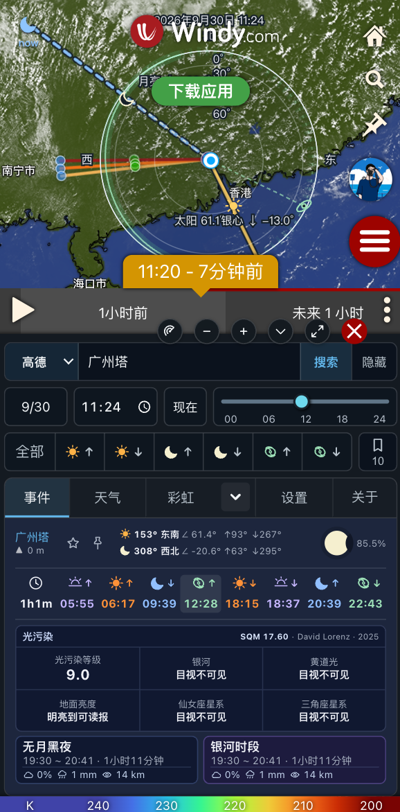
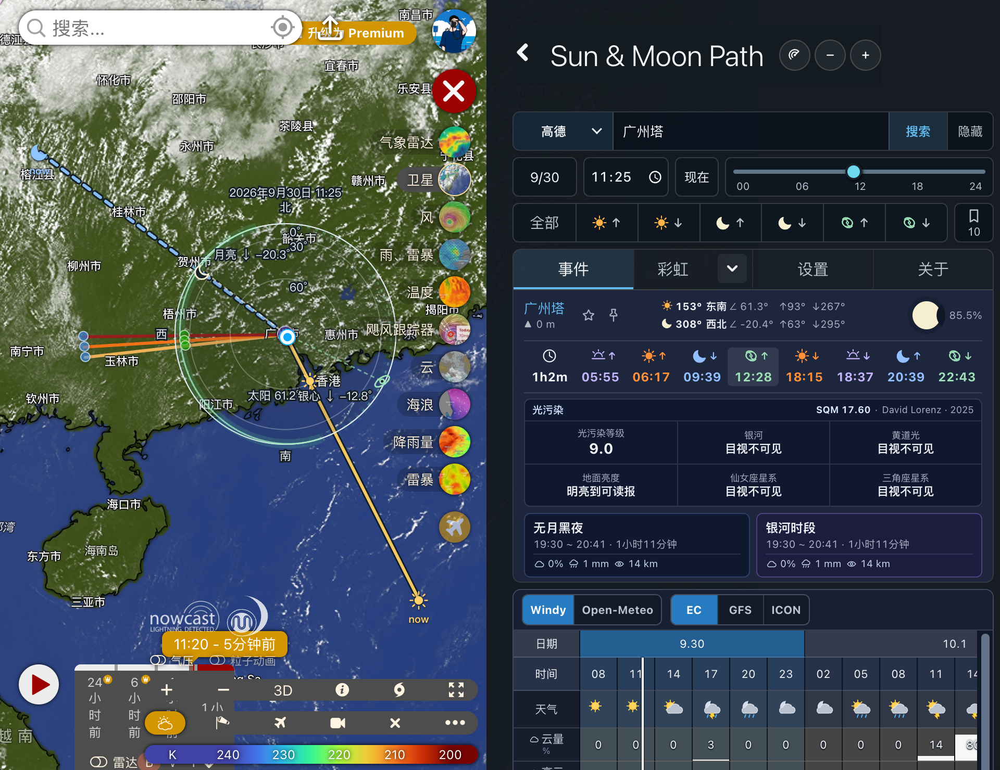

# Sun & Moon Path for Windy

[中文](README.md) · **English**

Plan sunrise, sunset, Moon and Milky Way photography on Windy. Use celestial directions, cloud distances, weather and favorite-location comparisons to choose when and where to shoot. Available in Chinese and English on desktop and mobile.

**Mobile**



**Desktop**



## Install and get started

Current release: **0.11.0** · [Release notes](https://github.com/bytepoem/windy-plugin-sun-moon-path/releases/tag/0.11.0)

Paste this URL into Windy's external plugin loader, then open **Sun & Moon Path**:

```text
https://windy-plugins.com/17629746/windy-plugin-sun-moon-path/0.11.0/plugin.min.js
```

1. **Choose a location:** click the map or enter WGS84 / GCJ-02 coordinates. Chinese place-name search requires your own map-service API Key in Settings.
2. **Choose a time:** select a date, then use the local time strip or Sun, Moon and galactic centre rise/set shortcuts.
3. **Check conditions:** explore events and weather, use cloud or rainbow planning, or compare 2–5 favorite locations.

Language and display options are in Settings; detailed legends are under Settings → User guide. The features below describe the current repository; refer to release notes for published-version availability.

## Features

| Feature | Purpose |
| --- | --- |
| Sun, Moon and Milky Way | Rise/set times, direction lines, Moon phase, moonless and Milky Way observing windows, plus a sky chart for composition |
| Cloud planning | Select the Sun, Moon or galactic centre and use forecast or manual cloud heights to view distances and sightline intersections; supports single/layered views and satellite comparison |
| Rainbow planning | Sunbow/moonbow directions and altitudes, double bows, full circles and primary-bow condition assessment |
| Weather and observing | Windy / Open-Meteo sources and forecast models, with observing windows informed by weather, moonlight and target position |
| Favorite comparisons | Reuse Windy favorites to compare weather, astronomical events, elevation and light pollution |
| Radar and display | RainViewer radar overlays, Windy units, and collapsed, compact or fullscreen mobile views |

## How to use the features

### Sun, Moon and Milky Way

Choose a location and date, then open Events for Sun/Moon rise and set times, Moon phase, moonless periods and Milky Way observing windows. Select a rise/set shortcut or event time, then adjust the local time strip and use direction lines and the sky chart to plan your composition.

### Cloud planning

Open Clouds and select the Sun, Moon or galactic centre and a shooting time. Choose a single or layered view and a forecast cloud-height source, or enter a known cloud altitude manually. Use sightline intersections, distance references and forecast cloud maps to identify cloud regions of interest; satellite imagery provides a comparison with current observations.

### Rainbow planning

Choose **Rainbow** from the dropdown beside Clouds, select Sun or Moon, and adjust the time. The map shows bow directions and altitudes: solid arcs are above the horizon, dashed arcs below it. Bows are hidden when the selected light source is below the horizon.

Select **Assess selected time** to check rain and sunlight along primary-bow directions, with separate terrain and route low-visibility references. Adjust camera height above ground to explore terrain effects.

**Bow geometry is a composition reference; condition grades are not probabilities.** Assessment uses hourly forecasts and limited samples, always with low confidence. It cannot prove that droplets are illuminated at the same instant; moonbows are not assessed. Terrain warnings do not prove the bow is blocked, and no detected obstruction does not guarantee a clear view. Seeing a double bow or full circle still depends on lit droplets and actual sightlines.

### Weather and observing

Open Weather and choose a data source and forecast model in the weather table. Check cloud cover, precipitation, wind and visibility for your target period, alongside observing windows, moonlight and target position. Compare again after changing sources or models, and treat missing values as unknown.

### Favorite comparisons

Use the top favorites button to save the current location or search and open existing Windy favorites. Select Compare, choose 2–5 locations and start the comparison to check weather, observing windows, elevation and light pollution for the same date and shortlist alternative shooting locations.

### Radar and display

In Settings, select the RainViewer radar source and adjust its opacity. Use Windy's timeline and the displayed radar timestamp to examine changes in rainfall. Settings also contains language and display options, while measurement units follow Windy. On mobile, use the panel controls to switch between collapsed, compact and fullscreen views.

## Usage limits

- **Planning time differs from now.** The shared time strip uses the location's time zone and resets to the current time when refreshed or reopened. Sun/Moon lines labeled `now` always show the actual current instant.
- **Sky charts show directions, not distances.** Milky Way bands and rainbow arcs are geometric illustrations; stroke widths are not actual angular widths or visibility guarantees.
- **Cloud distances are geometric references.** Local cloud heights do not describe distant clouds. Cloud-distance calculations do not check weather, terrain or cloud thickness along the path and cannot guarantee visibility or colorful twilight. See [cloud calculation principles and limits](docs/cloud-obstruction.md) (Chinese).
- **Sources and timestamps differ.** Weather, observing windows and favorite comparisons share the selected source. Automatic cloud heights come from Windy; satellite and radar show their own observation times. Missing data remain unknown without automatic source switching.
- **Forecasts are not observations.** Open-Meteo hourly precipitation covers the preceding hour; past model data are not on-site observations. Check current weather and conditions in the field.

## Local development

Current CI uses Node.js 24 and npm 11.12.1.

```sh
npm exec --yes --package=npm@11.12.1 -- npm install
npm test
npm start
```

Open [Windy Developer mode](https://www.windy.com/developer-mode) and load `https://localhost:9999/plugin.js`.

Run `npm run build` to generate `dist/`, including scripts, `plugin.json` and the screenshot. Maintenance notes (Chinese): [forecast request and component responsibilities](docs/refactor-0.11.0.md) · [update hosting and publishing](docs/update-hosting.md).

## Feedback and license

[Report a problem or suggestion](https://github.com/bytepoem/windy-plugin-sun-moon-path/issues) · [Author: bytepoem](https://github.com/bytepoem) · [RedNote](https://xhslink.cn/o/rXpBcBK0Qy) · [Optional support on Afdian](https://afdian.com/a/bytepoem) · [MIT License](LICENSE)
