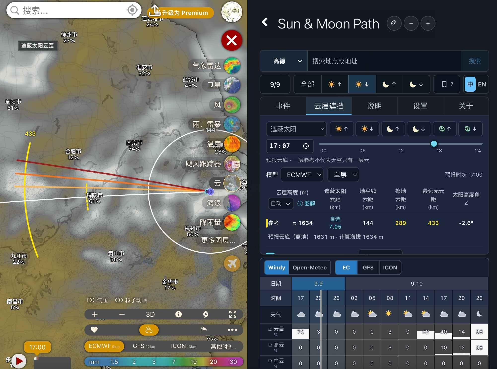

# Windy Community review reply for 0.6.1

```text
Hi @pavelmedia,

I have addressed the requested changes and published version 0.6.1:

- All plugin-owned listeners and timers, including singleclick.on, bcast.on, map.on, setInterval, and setTimeout, are now cleaned up in onDestroy. Pending weather/GPS work and plugin-created map layers are also stopped or removed when the plugin closes.
- Added the required screenshot at src/screenshot.jpg.
- The Chinese/English language selection now also persists in the current browser.

Plugin URL: https://windy-plugins.com/17629746/windy-plugin-sun-moon-path/0.6.1/plugin.min.js
Repository: https://github.com/bytepoem/windy-plugin-sun-moon-path
Release: https://github.com/bytepoem/windy-plugin-sun-moon-path/releases/tag/0.6.1

Please review it again. Thank you.
```

Attach this screenshot to the reply:


